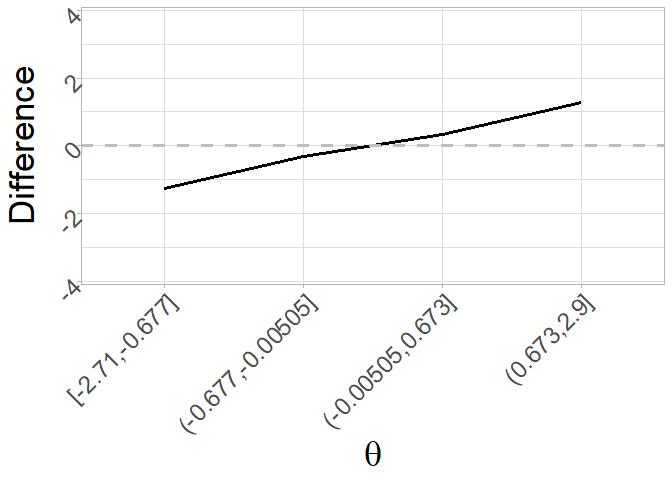

<!-- README.md is generated from README.Rmd. Please edit that file -->

# shortIRT

<!-- badges: start -->
<!-- badges: end -->

The goal of shortIRT is to simple tool for the development of static
short test forms (STFs) in an Item Response Theory (IRT) based
framework. Specifically, two main procedures are considered:

1.  The typical IRT-based procedure for the development of STFs (here
    denoted as benchmark procedure, BP), according to which the most
    informative items are selected without considering any specific
    level of the latent trait

2.  The IRT procedure based on the definition of levels of interest of
    the latent trait (i.e., $\theta$ targets, here denoted as
    $\theta$-target procedure). The selected items are those most
    informative in respect to the $\theta$ targets. This procedure can
    be further categorized according to the methodology used for the
    definition of the $\theta$ targets:

    1.  Equal interval procedure (EIP): The latent trait is divided in
        $n + 1$ (where $n$ is the number of items to be included in the
        STF) intervals of equal width and the central points of each
        interval are the $\theta$ targets
    2.  Unequal interval procedure (UIP): The latent trait is clustered
        in $n$ clusters (where $n$ is the number of items to be included
        in the STF) and centroids of each clusters are the $\theta$
        targets
    3.  User defined procedure (UDP): The user manually defines the
        $\theta$ targets to which the STF should tend to. They might
        also be the same $\theta$ values (e.g., for the development of a
        screening STF with a cut-off point).

## Installation

You can install the development version of shortIRT from
[GitHub](https://github.com/) with:

``` r
# install.packages("devtools")
devtools::install_github("OttaviaE/shortIRT")
```

## Example

In the example, a 5-item STF is developed from a full-length test of 20
items.

``` r
library(shortIRT)
```

First, generate the responses of 1,000 respondents to the 20 items of
the full-length test:

``` r
 # Simulate person and item parameters
 true_theta <- rnorm(1000)
 b <- runif(30, -3, 3)
 a <- runif(30, 0.6, 2)
 parameters <- data.frame(b, a)
 # simulate data
 data <- sirt::sim.raschtype(true_theta, b = b, fixed.a = a)
```

Then, use the EIP for the development of the 5-item STF, incuding also
the matrix of the item parameters and the true $\theta$ of the subjects
(these arguments are not mandatory).

``` r
stf_eip <- eip(data, item_par = parameters, starting_theta = true_theta, num_item = 5)
# Show the items included in the STF, the theta targets, and the IIFs of 
# the optimal item for each theta target
stf_eip$item_stf
#>     item theta_target item_info stf_length
#> 8    I08      -2.0400 0.6501277      STF-5
#> 42   I12      -0.7595 0.8160365      STF-5
#> 65   I05       0.5205 0.8583194      STF-5
#> 113  I23       1.7950 0.7219224      STF-5
#> 145  I25       3.0700 0.3271706      STF-5
```

Plot the test information function of both the full-length test and the
STF:

``` r
plot_tif(stf_eip, tif = "both")  + theme_light() + 
  ylab("Information") + xlab(expression(theta)) + 
  theme(axis.title = element_text(size = 26), 
        strip.text.x = element_text(size = 28))
```


Now, the bias between the true $\theta$ and the estimated $\theta$
($\hat{\theta}$) can be computed as well with the `diff_theta()`
function, which returns both the difference and the absolute difference
between $\theta$s:

``` r
bias_eip <- diff_theta(stf_eip, true_theta = true_theta)
head(bias_eip)
#>    true_theta     stf_theta  difference abs_difference
#> 1 -0.52859426  3.694458e-80 -0.52859426     0.52859426
#> 2  0.19472782  3.694458e-80  0.19472782     0.19472782
#> 3  1.86363627  8.015177e-79  1.86363627     1.86363627
#> 4 -0.44136616  3.694458e-80 -0.44136616     0.44136616
#> 5  0.03330607 -7.390894e-79  0.03330607     0.03330607
#> 6  0.57423427  6.055238e-79  0.57423427     0.57423427
```

Finally, bias can also be plotted with the function `plot_difference()`
as a function of different levels of $\theta$. Default is to plot the
difference as a function of 4 levels of $\theta$:

``` r
plot_difference(bias_eip) + theme_light() + 
  ylab("Difference") + xlab(expression(theta)) + 
  theme(axis.title = element_text(size = 26), 
        strip.text.x = element_text(size = 28), 
         axis.text = element_text(size = 18, angle = 45, hjust=1))
```



But this can be changed by changing the default of the arguments `type`
and `levels` to plot, for instance, the absolute difference for 20
levels of the latent trait:

``` r
plot_difference(bias_eip, type = "absolute_diff", levels = 20) + theme_light()  + xlab(expression(theta)) + 
  theme(axis.title = element_text(size = 26), 
        strip.text.x = element_text(size = 28), 
        axis.text = element_text(size = 18, angle = 45, hjust=1))
```


